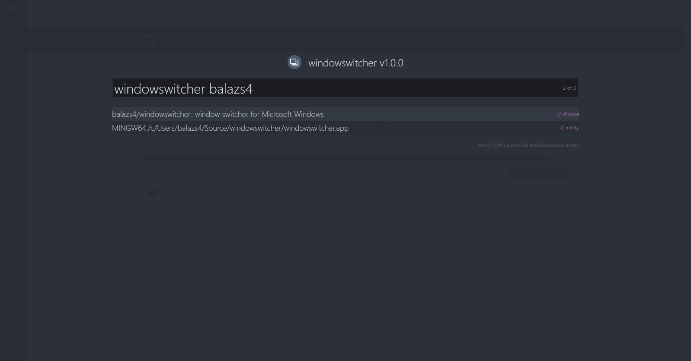

# windowswitcher

> window switcher for Microsoft Windows in order to avoid the alt+tab-hell

[Download](https://github.com/balazs4/windowswitcher/releases)

## Technologies used

+ C#.NET
+ WPF
+ MUSIA  for Finding and activating the windows / controls

## Authors

+ balazs4
+ L0rdKlappstuhl

## In-Action

<video width="320" height="240" controls>
  <source src="windowswitcher.mp4" type="video/mp4">
  <a href="https://raw.githubusercontent.com/balazs4/windowswitcher/master/windowswitcher.mp4">Download Video</a>
</video>